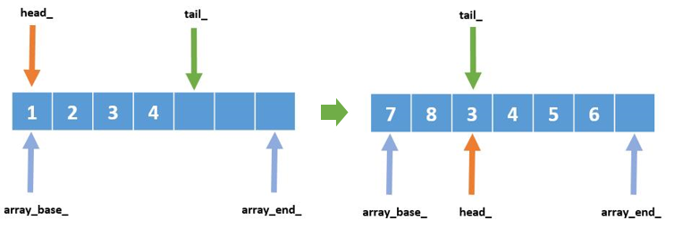

# STL-style Circular Buffer

## Usage


```c++
#include <iostream>
#include "circularBuffer.h"

int main(void){
  circular_buffer<int> cb(6);
  for (int i = 1; i < 9; ++i)	//3 4 5 6 7 8
		cb.push_back(i);
  for (auto i:cb)
    	std::cout << i << " ";
  std::cout << std::endl;	// expected output: 3 4 5 6 7 8
}
```

 